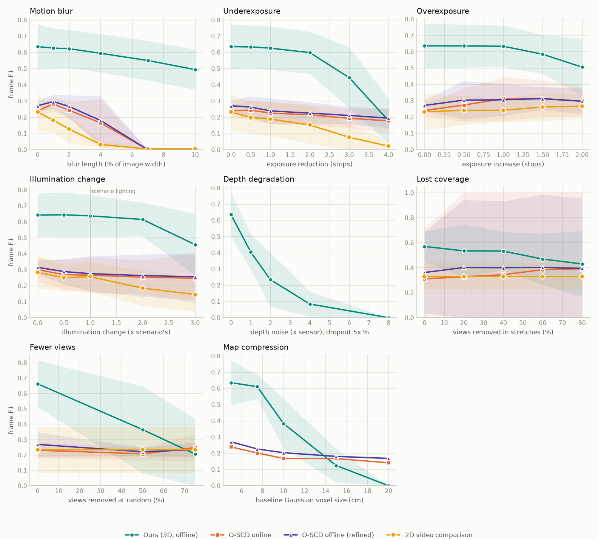
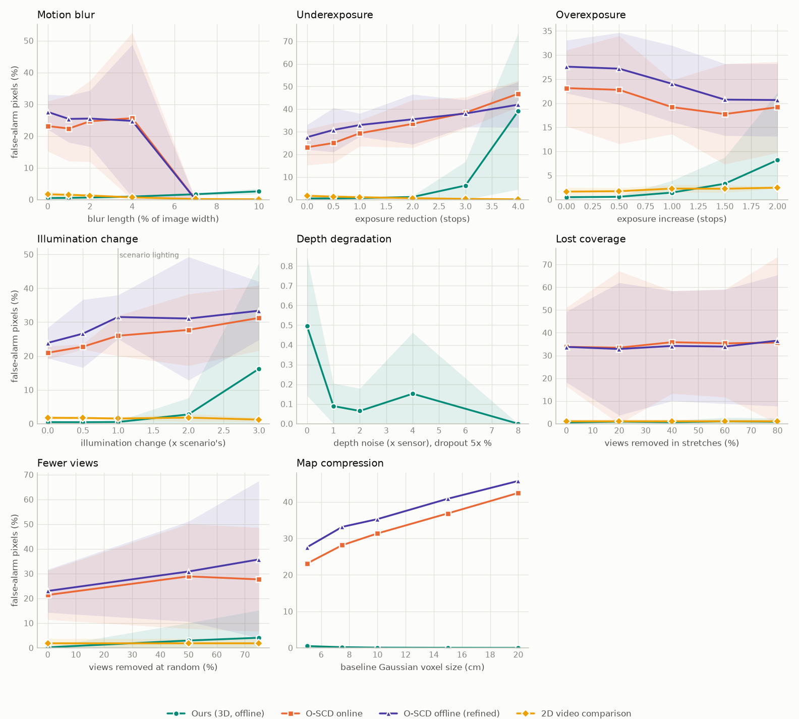
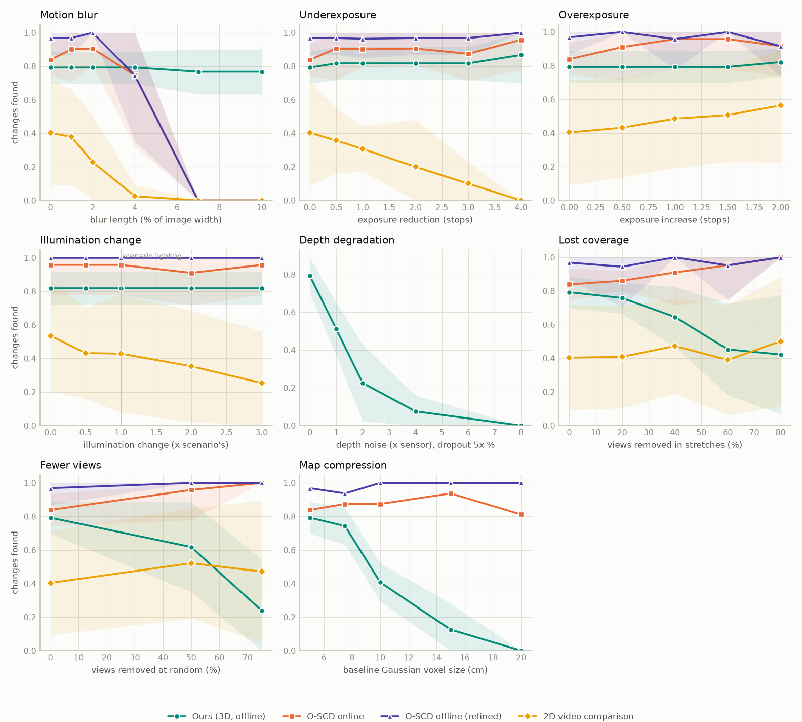
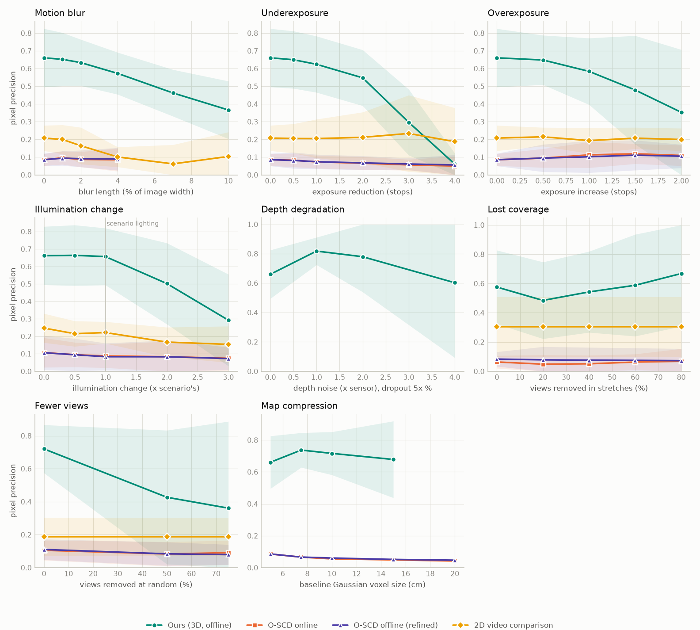
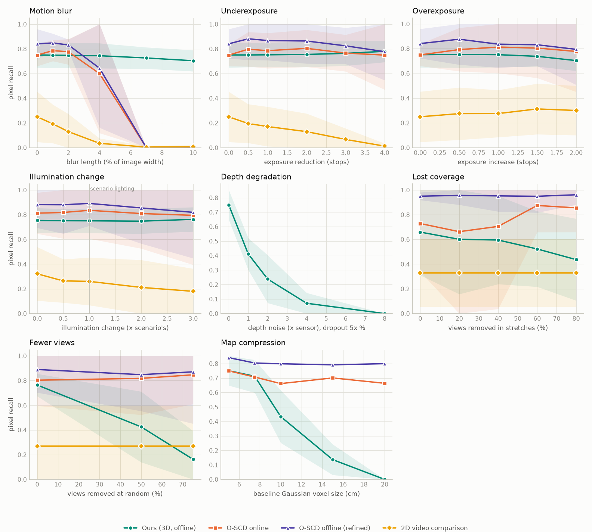
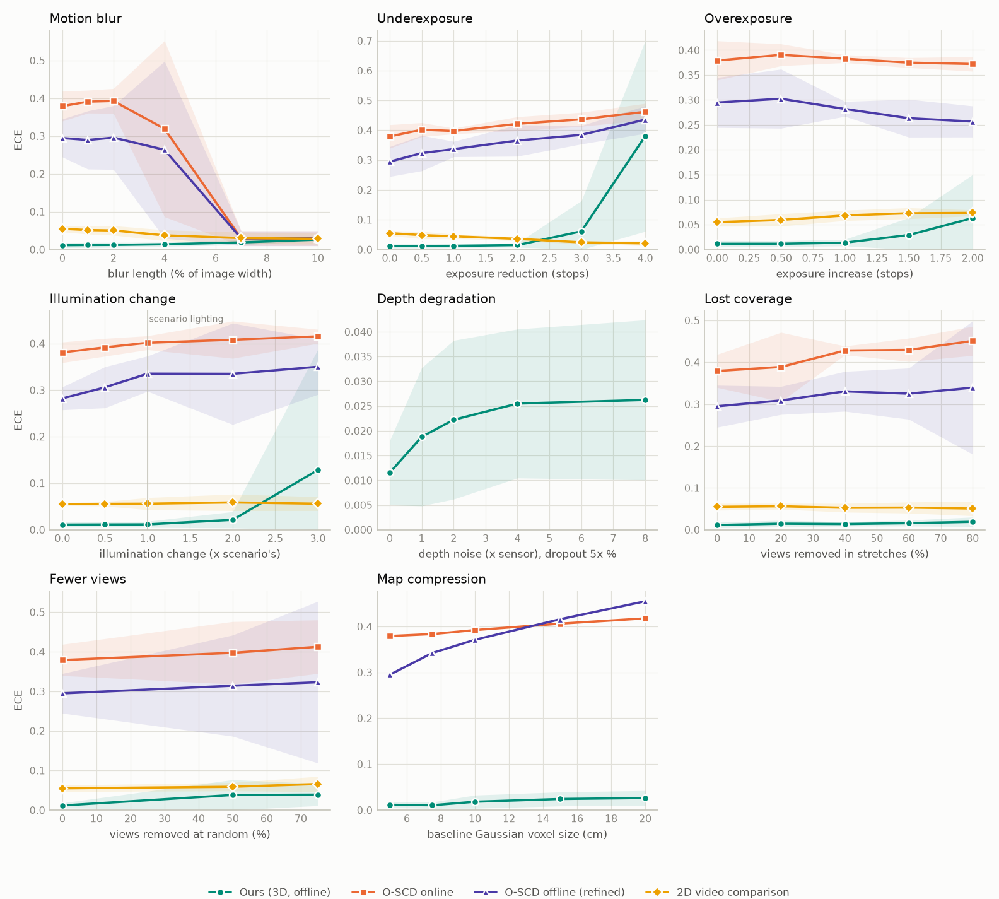
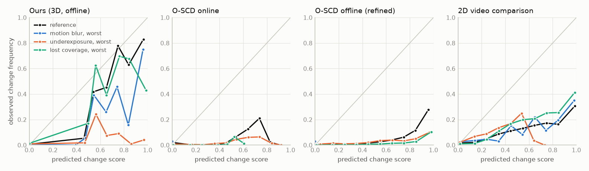
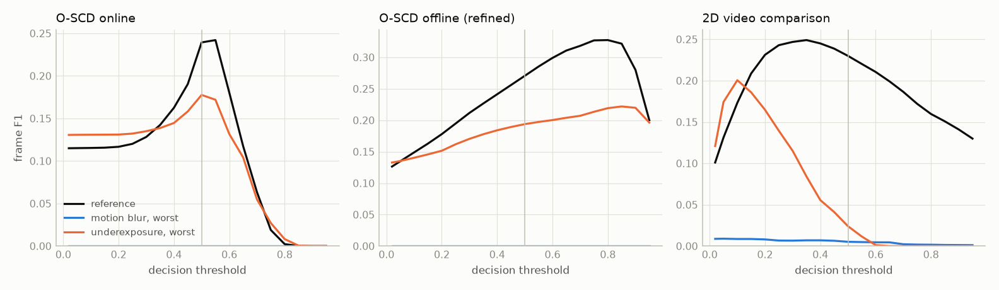

# Robustness of 3D change detection under capture degradation

Generated by `python -m scene_change.harness.robustness_report` from the sweeps of `scene_change.harness.robustness`. Scenes: held-out harness seeds 0, 1, 2, 3, 4 (`mixed`, 8 changes each), every second inspection frame. The reference capture is never degraded; each stressor degrades the inspection walkthrough only, and ground truth is unchanged by construction.

> **Interim, 25 Sep 2026.** Our detector, its confirmed-only variant and the 2D video
> comparison are complete on all 5 held-out scenes. O-SCD is partial (96 of 150 levels):
> scenes 0 and 3 complete, scenes 1 and 4 partial, scene 2 not started. O-SCD numbers
> below will move. The main sweep evaluates our detector as it was before the two safeguards at the
> end of this summary.

## Findings so far

Against the proposal's success criteria: (1) failure boundaries, (2) whether change
scores stay calibrated, (3) offline against online behaviour.

**1. Where each method breaks** (first level with a significant 20% drop in frame F1):

- **2D video comparison** breaks first. It fails at 1% motion blur (F1 −21%, near zero from
  4%), at −2 EV underexposure (−34%) and at a 2× lighting change (−28%). It fails
  quietly: it can no longer align frames, so it stops flagging anything.
- **Our 3D detector** holds against image degradation until it is severe: 10% blur
  (−22%) and −3 EV (−30%). Its confirmed detections never fail under blur, exposure or
  lighting, because they come from depth. It breaks early where depth or views matter: at
  the first level of added depth noise (−36%), with half of the frames removed (−45%),
  and with the baseline map coarsened to 10 cm Gaussians (−40%).
- **O-SCD** (interim) collapses at 7% blur (−100%). PnP localises no frame, so there is
  no output at all. It loses about a quarter of its F1 at −4 EV and holds against lighting
  changes and view removal. Its F1 is low throughout (about 0.24 online, 0.27 refined), with
  23–28% of pixels flagged on frames without change.

**2. Do the scores say when to worry?**

- On clean captures, our per-detection scores are well ordered: detections scored
  0.85–1 are right 100% of the time, those scored 0.4–0.55 only 15%. Under the most
  severe levels the top band drops to 51%. At −4 EV, 45% of false-positive pixels carry a
  score of 0.9 or more, so errors become confident. A calibration map fitted on clean
  scenes barely helps (ECE 0.38 → 0.33). The review flag holds up better: confirmed
  detections stay 85–100% correct under every image stressor.
- The 2D method's scores recalibrate well under every stressor (ECE about 0.02 after the
  clean-fitted map), but they stop ranking changes under blur (AP 0.13 → 0.03).
- O-SCD's change scores are poorly calibrated even on clean captures (ECE 0.30–0.38).
- Run-level warning signals: the 2D method's share of aligned frames tracks its accuracy
  (rank correlation 0.64). Our depth agreement tracks depth failures (0.61) but not
  appearance failures. O-SCD's share of PnP-localised frames tracks weakly (0.25–0.36).

**3. Offline against online** (interim):

- O-SCD's live masks get worse along the walkthrough (F1 0.27 in the first third, 0.18
  in the last). Refinement over the whole walk holds up better late (0.24).
- Removing frames *helps* O-SCD online on the frames that remain (+53% F1 under lost
  coverage, fewer frames to accumulate error), while our offline detector needs the
  views (−69% with 75% removed).
- Blur defeats both O-SCD modes alike: refinement cannot recover from failed
  localisation.

**Unobserved changes.** When stretches of the walk are removed, our detector reports every
change that no kept frame shows as not checked (23 of 23). The other methods report no
change there.

**Map compression** (proposal's extension): small changes fail first. At 7.5 cm
Gaussians (76k instead of about 190k) nothing is lost. At 10 cm, 6% of small changes are
still found against 71% of large ones.

## Safeguards added from these results

Both thresholds were set on the development scenes (s100, s101) and then checked on the
held-out ones. On the standard benchmark neither fires, and scores are unchanged to
within 0.001 (`RESULTS.md`).

- **No all-clear from noisy depth.** Before: with heavy depth noise, our detector found
  nothing and reported "Guest-ready" on all 5 held-out scenes that had 8 changes. Now a
  clean verdict needs at least 80% of the depth to agree with the baseline. Wrong
  all-clears fell from 6 to 0, and the safeguard never fired on unmodified captures
  (`depth_gate.json`).
- **No restyle flood from bad exposure.** Clipped or crushed pixels, and frames whose
  colour fit hits its gain limits, no longer count as appearance evidence. At −4 EV, frame
  F1 went from 0.18 to 0.56 and false-alarm pixels from 39% to 0.4%, with confirmed
  detections unchanged. Unmodified captures were unaffected (`exposure_gate.json`).

**When not to trust a result:** motion blur beyond about 1% of the frame width for 2D
comparison, and beyond about 4% for O-SCD's localisation. A walkthrough with fewer than
about half its frames, or with depth noise above the sensor's own, for our detector. Any
restyle flag from a strongly under- or overexposed visit.

## Reference performance

Unmodified walkthroughs. Frame scores follow the PASLCD protocol at each method's own threshold; change recall counts a change as found when at least a quarter of its pixels are flagged. ECE and AP use the continuous change scores (ours: the highest detection score covering a pixel).

| Method | Frame F1 | Frame IoU | False-alarm px | Change recall | ECE | AP | Frames/s |
|---|---|---|---|---|---|---|---|
| Ours (3D, offline) | 0.635 | 0.518 | 0.49% | 0.793 | 0.012 | 0.574 | 5.44 |
| Ours, confirmed only | 0.555 | 0.453 | 0.07% | 0.586 | 0.014 | 0.490 | - |
| O-SCD online | 0.239 | 0.154 | 23.13% | 0.839 | 0.379 | 0.131 | 0.18 |
| O-SCD offline (refined) | 0.271 | 0.175 | 27.59% | 0.969 | 0.295 | 0.209 | 0.18 |
| 2D video comparison | 0.231 | 0.168 | 1.65% | 0.404 | 0.055 | 0.129 | 2.47 |

## Performance against severity

Bands are 95% intervals over scenes, drawn where at least 3 scenes are in. Frame scores for lost coverage and fewer views use the frames every level kept.

## False positives and misses

Pixel precision falls when false positives grow; pixel recall falls when changes are missed.

Where the false positives are, at the reference and at each stressor's most severe level: share of false-positive pixels farther than 3 px from any real change (the rest hug real changes: boundary and alignment errors), and share of change-free frames with a false alarm of at least 20 px.

| Method | Condition | Pixel precision | Pixel recall | False positives away from changes | Change-free frames flagged |
|---|---|---|---|---|---|
| Ours (3D, offline) | reference | 0.661 | 0.751 | 59.85% | 32.22% |
| Ours (3D, offline) | Motion blur, 10% | 0.366 | 0.704 | 89.52% | 74.09% |
| Ours (3D, offline) | Underexposure, -4 EV | 0.061 | 0.780 | 97.64% | 92.47% |
| Ours (3D, offline) | Overexposure, +2 EV | 0.353 | 0.704 | 79.88% | 59.79% |
| Ours (3D, offline) | Illumination change, s=3 | 0.293 | 0.763 | 89.76% | 67.18% |
| Ours (3D, offline) | Depth degradation, x8 | - | 0.000 | - | 0.00% |
| Ours (3D, offline) | Lost coverage, 80% removed | 0.668 | 0.437 | 59.43% | 28.20% |
| Ours (3D, offline) | Fewer views, 75% removed | 0.361 | 0.162 | 74.90% | 17.54% |
| Ours (3D, offline) | Map compression, 20 cm | - | 0.000 | - | 0.00% |
| Ours, confirmed only | reference | 0.806 | 0.569 | 28.61% | 3.27% |
| Ours, confirmed only | Motion blur, 10% | 0.807 | 0.566 | 28.73% | 3.27% |
| Ours, confirmed only | Underexposure, -4 EV | 0.770 | 0.557 | 39.09% | 5.17% |
| Ours, confirmed only | Overexposure, +2 EV | 0.805 | 0.564 | 28.64% | 3.27% |
| Ours, confirmed only | Illumination change, s=3 | 0.790 | 0.575 | 32.36% | 3.90% |
| Ours, confirmed only | Depth degradation, x8 | - | 0.000 | - | 0.00% |
| Ours, confirmed only | Lost coverage, 80% removed | 0.849 | 0.263 | 8.14% | 0.00% |
| Ours, confirmed only | Fewer views, 75% removed | 0.627 | 0.074 | 38.93% | 6.67% |
| Ours, confirmed only | Map compression, 20 cm | - | 0.000 | - | 0.00% |
| O-SCD online | reference | 0.086 | 0.750 | 96.50% | 92.60% |
| O-SCD online | Motion blur, 10% | - | 0.000 | - | 0.00% |
| O-SCD online | Underexposure, -4 EV | 0.050 | 0.750 | 98.09% | 98.92% |
| O-SCD online | Overexposure, +2 EV | 0.110 | 0.778 | 96.63% | 96.22% |
| O-SCD online | Illumination change, s=3 | 0.075 | 0.795 | 97.45% | 98.39% |
| O-SCD online | Lost coverage, 80% removed | 0.068 | 0.856 | 97.30% | 100.00% |
| O-SCD online | Fewer views, 75% removed | 0.091 | 0.847 | 97.17% | 94.44% |
| O-SCD online | Map compression, 20 cm | 0.042 | 0.664 | 98.22% | 92.06% |
| O-SCD offline (refined) | reference | 0.086 | 0.841 | 96.53% | 96.26% |
| O-SCD offline (refined) | Motion blur, 10% | - | 0.000 | - | 0.00% |
| O-SCD offline (refined) | Underexposure, -4 EV | 0.056 | 0.777 | 97.76% | 98.92% |
| O-SCD offline (refined) | Overexposure, +2 EV | 0.105 | 0.794 | 96.50% | 98.92% |
| O-SCD offline (refined) | Illumination change, s=3 | 0.073 | 0.819 | 97.32% | 99.44% |
| O-SCD offline (refined) | Lost coverage, 80% removed | 0.073 | 0.962 | 97.17% | 100.00% |
| O-SCD offline (refined) | Fewer views, 75% removed | 0.079 | 0.871 | 97.27% | 94.44% |
| O-SCD offline (refined) | Map compression, 20 cm | 0.047 | 0.799 | 97.88% | 92.06% |
| 2D video comparison | reference | 0.208 | 0.250 | 96.56% | 51.13% |
| 2D video comparison | Motion blur, 10% | 0.104 | 0.008 | 97.12% | 2.95% |
| 2D video comparison | Underexposure, -4 EV | 0.187 | 0.013 | 99.77% | 9.47% |
| 2D video comparison | Overexposure, +2 EV | 0.200 | 0.301 | 96.48% | 60.04% |
| 2D video comparison | Illumination change, s=3 | 0.154 | 0.180 | 97.55% | 40.16% |
| 2D video comparison | Lost coverage, 80% removed | 0.303 | 0.329 | 93.96% | 46.14% |
| 2D video comparison | Fewer views, 75% removed | 0.187 | 0.269 | 96.47% | 55.52% |

## Does each method know when it is failing?

Each method has an internal signal of how the run went: the 2D method knows how many frames it could align to a baseline frame, O-SCD how many it could localise with PnP, and our detector how much of its depth agrees with the baseline surfaces. Rank correlation over all runs between that signal and frame F1 (1: the signal tracks accuracy; 0: it says nothing), and the signal at the reference and at each stressor's most severe level. Our detector sends uncertain detections to review instead of confirming them; the second table shows how well that separates right from wrong.

| Method | Signal | Correlation with F1 | Reference | Motion blur | Underexposure | Overexposure | Illumination change | Depth degradation | Lost coverage | Fewer views | Map compression |
|---|---|---|---|---|---|---|---|---|---|---|---|
| Ours (3D, offline) | depth points agreeing with the baseline (recorded from the depth and compression sweeps on) | 0.61 (n=45) | 86.04% | - | - | - | - | 35.62% | - | - | 79.92% |
| O-SCD online | frames localised by PnP | 0.17 (n=96) | 61.29% | 0.00% | 50.30% | 50.76% | 47.46% | - | 75.44% | 65.28% | 59.28% |
| O-SCD offline (refined) | frames localised by PnP | 0.29 (n=96) | 61.29% | 0.00% | 50.30% | 50.76% | 47.46% | - | 75.44% | 65.28% | 59.28% |
| 2D video comparison | frames aligned to a baseline frame | 0.64 (n=130) | 85.17% | 7.42% | 77.33% | 83.54% | 78.93% | - | 89.53% | 82.89% | - |

Precision of our detections, confirmed ones against all (share matching a real change):

| Condition | All detections | Confirmed only |
|---|---|---|
| reference | 0.59 | 1.00 |
| Motion blur, 10% | 0.24 | 1.00 |
| Underexposure, -4 EV | 0.16 | 0.85 |
| Overexposure, +2 EV | 0.43 | 1.00 |
| Illumination change, s=3 | 0.31 | 0.97 |
| Depth degradation, x8 | - | - |
| Lost coverage, 80% removed | 0.65 | 1.00 |
| Fewer views, 75% removed | 0.45 | 0.88 |
| Map compression, 20 cm | - | - |

## Failure boundaries

First severity at which mean frame F1 falls at least 20% below the reference, with a paired 95% interval over scenes that excludes no change; `none` means no such level in the tested range. The steepest step is the pair of neighbouring levels with the largest F1 drop.

| Stressor | Ours (3D, offline) | Ours, confirmed only | O-SCD online | O-SCD offline (refined) | 2D video comparison |
|---|---|---|---|---|---|
| Motion blur | 10% (-22%); steepest 7% to 10% (-0.056) | none; steepest reference to 1% (-0.003) | 7% (-100%); steepest 4% to 7% (-0.165) | 7% (-100%); steepest 4% to 7% (-0.179) | 1% (-21%); steepest 2% to 4% (-0.095) |
| Underexposure | -3 EV (-30%); steepest -3 EV to -4 EV (-0.265) | none; steepest -2 EV to -3 EV (-0.021) | -4 EV (-26%); steepest -2 EV to -3 EV (-0.022) | -3 EV (-22%); steepest -0.5 EV to -1 EV (-0.023) | -2 EV (-34%); steepest -2 EV to -3 EV (-0.075) |
| Overexposure | none; steepest +1.5 EV to +2 EV (-0.079) | none; steepest +1.5 EV to +2 EV (-0.003) | none; steepest +1.5 EV to +2 EV (-0.014) | none; steepest +1.5 EV to +2 EV (-0.016) | none; steepest +0.5 EV to +1 EV (-0.000) |
| Illumination change | none; steepest s=2 to s=3 (-0.157) | none | none; steepest s=1 to s=2 (-0.012) | none; steepest s=1 to s=2 (-0.012) | s=2 (-28%); steepest s=1 to s=2 (-0.072) |
| Depth degradation | x1 (-36%); steepest reference to x1 (-0.230) | x1 (-41%); steepest reference to x1 (-0.226) | - | - | - |
| Lost coverage | none; steepest 40% removed to 60% removed (-0.063) | none; steepest 40% removed to 60% removed (-0.092) | none | none; steepest 60% removed to 80% removed (-0.008) | none |
| Fewer views | 50% removed (-45%); steepest reference to 50% removed (-0.298) | 50% removed (-44%); steepest reference to 50% removed (-0.256) | none; steepest reference to 50% removed (-0.023) | none; steepest reference to 50% removed (-0.048) | none |
| Map compression | 10 cm (-40%); steepest 10 cm to 15 cm (-0.258) | 10 cm (-31%); steepest 10 cm to 15 cm (-0.259) | none; steepest reference to 7.5 cm (-0.038) | none; steepest reference to 7.5 cm (-0.044) | - |

## Per-level scores

### Motion blur (linear motion blur along the apparent camera motion)

| Method | Metric | reference | 1% | 2% | 4% | 7% | 10% |
|---|---|---|---|---|---|---|---|
| Ours (3D, offline) | frame F1 | 0.635 | 0.626 | 0.622 | 0.594* | 0.550* | 0.494* |
| Ours (3D, offline) | false alarms | 0.49% | 0.54% | 0.65% | 0.94%* | 1.69%* | 2.59%* |
| Ours (3D, offline) | ECE | 0.012 | 0.012 | 0.012 | 0.014* | 0.019* | 0.026* |
| Ours, confirmed only | frame F1 | 0.555 | 0.551 | 0.551 | 0.548 | 0.548 | 0.552 |
| Ours, confirmed only | false alarms | 0.07% | 0.07% | 0.07% | 0.07% | 0.07% | 0.07% |
| Ours, confirmed only | ECE | 0.014 | 0.014 | 0.014 | 0.014 | 0.014 | 0.015 |
| O-SCD online | frame F1 | 0.239 | 0.281* | 0.243 | 0.165 | 0.000* | 0.000* |
| O-SCD online | false alarms | 23.13% | 22.36% | 24.64% | 25.63% | 0.00%* | 0.00%* |
| O-SCD online | ECE | 0.379 | 0.391 | 0.393 | 0.319 | 0.030* | 0.030* |
| O-SCD offline (refined) | frame F1 | 0.271 | 0.296 | 0.266 | 0.179 | 0.000* | 0.000* |
| O-SCD offline (refined) | false alarms | 27.59% | 25.38% | 25.49% | 24.77% | 0.00%* | 0.00%* |
| O-SCD offline (refined) | ECE | 0.295 | 0.290 | 0.296 | 0.264 | 0.030* | 0.030* |
| 2D video comparison | frame F1 | 0.231 | 0.182* | 0.127* | 0.032* | 0.004* | 0.005* |
| 2D video comparison | false alarms | 1.65% | 1.50% | 1.26%* | 0.70%* | 0.18%* | 0.08%* |
| 2D video comparison | ECE | 0.055 | 0.052 | 0.050 | 0.038* | 0.030* | 0.029* |

`*` paired 95% interval over scenes excludes no change from the reference.

### Underexposure (underexposure: less light reaches the sensor)

| Method | Metric | reference | -0.5 EV | -1 EV | -2 EV | -3 EV | -4 EV |
|---|---|---|---|---|---|---|---|
| Ours (3D, offline) | frame F1 | 0.635 | 0.633 | 0.626 | 0.598* | 0.444* | 0.179* |
| Ours (3D, offline) | false alarms | 0.49% | 0.53%* | 0.66%* | 1.15%* | 6.21% | 39.14%* |
| Ours (3D, offline) | ECE | 0.012 | 0.012 | 0.012* | 0.015* | 0.061 | 0.380* |
| Ours, confirmed only | frame F1 | 0.555 | 0.555 | 0.555 | 0.557 | 0.536 | 0.535 |
| Ours, confirmed only | false alarms | 0.07% | 0.07% | 0.07% | 0.07% | 0.07% | 0.09% |
| Ours, confirmed only | ECE | 0.014 | 0.014 | 0.014 | 0.015 | 0.015 | 0.015* |
| O-SCD online | frame F1 | 0.239 | 0.244 | 0.225 | 0.215 | 0.193* | 0.178* |
| O-SCD online | false alarms | 23.13% | 25.01% | 29.33%* | 33.47% | 38.40%* | 46.79%* |
| O-SCD online | ECE | 0.379 | 0.402 | 0.398 | 0.422 | 0.436 | 0.462 |
| O-SCD offline (refined) | frame F1 | 0.271 | 0.262 | 0.239 | 0.225 | 0.211* | 0.194* |
| O-SCD offline (refined) | false alarms | 27.59% | 30.79% | 32.97% | 35.49% | 38.05%* | 41.97%* |
| O-SCD offline (refined) | ECE | 0.295 | 0.323 | 0.337 | 0.365 | 0.385* | 0.436* |
| 2D video comparison | frame F1 | 0.231 | 0.198 | 0.188* | 0.152* | 0.077* | 0.021* |
| 2D video comparison | false alarms | 1.65% | 1.31% | 1.06%* | 0.61%* | 0.32%* | 0.11%* |
| 2D video comparison | ECE | 0.055 | 0.049 | 0.044* | 0.036* | 0.024* | 0.021* |

`*` paired 95% interval over scenes excludes no change from the reference.

### Overexposure (overexposure: highlights clip)

| Method | Metric | reference | +0.5 EV | +1 EV | +1.5 EV | +2 EV |
|---|---|---|---|---|---|---|
| Ours (3D, offline) | frame F1 | 0.635 | 0.635 | 0.633 | 0.584 | 0.505 |
| Ours (3D, offline) | false alarms | 0.49% | 0.58% | 1.45% | 3.29% | 8.21% |
| Ours (3D, offline) | ECE | 0.012 | 0.012 | 0.014 | 0.029 | 0.063 |
| Ours, confirmed only | frame F1 | 0.555 | 0.555 | 0.555 | 0.555 | 0.551 |
| Ours, confirmed only | false alarms | 0.07% | 0.07% | 0.07% | 0.07% | 0.07% |
| Ours, confirmed only | ECE | 0.014 | 0.014 | 0.014 | 0.014 | 0.015 |
| O-SCD online | frame F1 | 0.239 | 0.273 | 0.311 | 0.311 | 0.297 |
| O-SCD online | false alarms | 23.13% | 22.77% | 19.19%* | 17.75%* | 19.17%* |
| O-SCD online | ECE | 0.379 | 0.391 | 0.383 | 0.375 | 0.372 |
| O-SCD offline (refined) | frame F1 | 0.271 | 0.303 | 0.305 | 0.312 | 0.296 |
| O-SCD offline (refined) | false alarms | 27.59% | 27.17% | 24.04% | 20.74%* | 20.67%* |
| O-SCD offline (refined) | ECE | 0.295 | 0.302 | 0.282 | 0.263* | 0.257* |
| 2D video comparison | frame F1 | 0.231 | 0.241 | 0.241 | 0.261 | 0.266 |
| 2D video comparison | false alarms | 1.65% | 1.74% | 2.28% | 2.25% | 2.48%* |
| 2D video comparison | ECE | 0.055 | 0.059 | 0.068* | 0.073* | 0.074* |

`*` paired 95% interval over scenes excludes no change from the reference.

### Illumination change (room lights, lamps, white balance and exposure moved from the baseline visit's lighting (0) past the scenario's inspection lighting (1))

| Method | Metric | s=0 | s=0.5 | s=1 | s=2 | s=3 |
|---|---|---|---|---|---|---|
| Ours (3D, offline) | frame F1 | 0.642 | 0.643 | 0.637 | 0.614 | 0.457 |
| Ours (3D, offline) | false alarms | 0.46% | 0.46% | 0.51% | 2.75% | 16.21% |
| Ours (3D, offline) | ECE | 0.011 | 0.011 | 0.012 | 0.021 | 0.128 |
| Ours, confirmed only | frame F1 | 0.555 | 0.555 | 0.551 | 0.555 | 0.556 |
| Ours, confirmed only | false alarms | 0.07% | 0.07% | 0.07% | 0.07% | 0.07% |
| Ours, confirmed only | ECE | 0.014 | 0.014 | 0.014 | 0.014 | 0.015 |
| O-SCD online | frame F1 | 0.300 | 0.269 | 0.266 | 0.253 | 0.247 |
| O-SCD online | false alarms | 20.96% | 22.76% | 25.99% | 27.72% | 31.25% |
| O-SCD online | ECE | 0.381 | 0.392 | 0.402 | 0.408 | 0.415 |
| O-SCD offline (refined) | frame F1 | 0.315 | 0.288 | 0.275 | 0.263 | 0.255 |
| O-SCD offline (refined) | false alarms | 23.88%* | 26.61% | 31.53% | 31.07% | 33.37% |
| O-SCD offline (refined) | ECE | 0.282 | 0.306 | 0.335 | 0.335 | 0.350 |
| 2D video comparison | frame F1 | 0.284 | 0.249 | 0.256 | 0.185* | 0.145* |
| 2D video comparison | false alarms | 1.76% | 1.70% | 1.54% | 1.81% | 1.22% |
| 2D video comparison | ECE | 0.055 | 0.056 | 0.056 | 0.059 | 0.056 |

`*` paired 95% interval over scenes excludes no change from the reference.

### Depth degradation (noisier and missing depth, as from a worse or moving depth sensor)

| Method | Metric | reference | x1 | x2 | x4 | x8 |
|---|---|---|---|---|---|---|
| Ours (3D, offline) | frame F1 | 0.635 | 0.405* | 0.234* | 0.084* | 0.000* |
| Ours (3D, offline) | false alarms | 0.49% | 0.09%* | 0.06%* | 0.15% | 0.00%* |
| Ours (3D, offline) | ECE | 0.012 | 0.019 | 0.022* | 0.026* | 0.026* |
| Ours, confirmed only | frame F1 | 0.555 | 0.328* | 0.191* | 0.080* | 0.000* |
| Ours, confirmed only | false alarms | 0.07% | 0.02% | 0.02% | 0.01% | 0.00% |
| Ours, confirmed only | ECE | 0.014 | 0.021 | 0.023* | 0.025* | 0.026* |
| O-SCD online | frame F1 | 0.239 | - | - | - | - |
| O-SCD online | false alarms | 23.13% | - | - | - | - |
| O-SCD online | ECE | 0.379 | - | - | - | - |
| O-SCD offline (refined) | frame F1 | 0.271 | - | - | - | - |
| O-SCD offline (refined) | false alarms | 27.59% | - | - | - | - |
| O-SCD offline (refined) | ECE | 0.295 | - | - | - | - |
| 2D video comparison | frame F1 | 0.231 | - | - | - | - |
| 2D video comparison | false alarms | 1.65% | - | - | - | - |
| 2D video comparison | ECE | 0.055 | - | - | - | - |

`*` paired 95% interval over scenes excludes no change from the reference.

### Lost coverage (contiguous stretches of the walkthrough removed (areas never filmed))

| Method | Metric | reference | 20% removed | 40% removed | 60% removed | 80% removed |
|---|---|---|---|---|---|---|
| Ours (3D, offline) | frame F1 | 0.569 | 0.534 | 0.532 | 0.469 | 0.430 |
| Ours (3D, offline) | false alarms | 0.56% | 0.93% | 0.67% | 1.03% | 0.85% |
| Ours (3D, offline) | ECE | 0.012 | 0.015 | 0.014 | 0.016 | 0.019 |
| Ours, confirmed only | frame F1 | 0.364 | 0.320 | 0.316 | 0.224 | 0.199 |
| Ours, confirmed only | false alarms | 0.01% | 0.01% | 0.00% | 0.01% | 0.00%* |
| Ours, confirmed only | ECE | 0.014 | 0.016* | 0.014 | 0.015 | 0.019 |
| O-SCD online | frame F1 | 0.310 | 0.327 | 0.343 | 0.383 | 0.391 |
| O-SCD online | false alarms | 33.81% | 33.44% | 35.85% | 35.35% | 35.71% |
| O-SCD online | ECE | 0.379 | 0.389* | 0.428 | 0.430 | 0.451 |
| O-SCD offline (refined) | frame F1 | 0.361 | 0.401 | 0.399 | 0.402 | 0.394 |
| O-SCD offline (refined) | false alarms | 33.78% | 32.86% | 34.20% | 33.93% | 36.55%* |
| O-SCD offline (refined) | ECE | 0.295 | 0.309 | 0.330 | 0.325 | 0.339 |
| 2D video comparison | frame F1 | 0.330 | 0.330 | 0.330 | 0.330 | 0.330 |
| 2D video comparison | false alarms | 1.08% | 1.08% | 1.08% | 1.08% | 1.08% |
| 2D video comparison | ECE | 0.055 | 0.056 | 0.053 | 0.053 | 0.051 |

`*` paired 95% interval over scenes excludes no change from the reference.

### Fewer views (views removed uniformly at random (lower frame rate))

| Method | Metric | reference | 50% removed | 75% removed |
|---|---|---|---|---|
| Ours (3D, offline) | frame F1 | 0.663 | 0.365* | 0.206* |
| Ours (3D, offline) | false alarms | 0.23% | 2.97% | 4.09% |
| Ours (3D, offline) | ECE | 0.012 | 0.038 | 0.039* |
| Ours, confirmed only | frame F1 | 0.581 | 0.325* | 0.122* |
| Ours, confirmed only | false alarms | 0.06% | 0.49% | 3.90% |
| Ours, confirmed only | ECE | 0.014 | 0.026* | 0.038 |
| O-SCD online | frame F1 | 0.230 | 0.207 | 0.247 |
| O-SCD online | false alarms | 21.38% | 28.91% | 27.68% |
| O-SCD online | ECE | 0.379 | 0.397* | 0.413* |
| O-SCD offline (refined) | frame F1 | 0.269 | 0.220 | 0.235 |
| O-SCD offline (refined) | false alarms | 22.99% | 30.87% | 35.75% |
| O-SCD offline (refined) | ECE | 0.295 | 0.314 | 0.323 |
| 2D video comparison | frame F1 | 0.233 | 0.233 | 0.233 |
| 2D video comparison | false alarms | 1.87% | 1.87% | 1.87% |
| 2D video comparison | ECE | 0.055 | 0.059 | 0.066 |

`*` paired 95% interval over scenes excludes no change from the reference.

### Map compression (coarser baseline map: fewer, larger Gaussians (lower capacity))

| Method | Metric | reference | 7.5 cm | 10 cm | 15 cm | 20 cm |
|---|---|---|---|---|---|---|
| Ours (3D, offline) | frame F1 | 0.635 | 0.610 | 0.383* | 0.125* | 0.000* |
| Ours (3D, offline) | false alarms | 0.49% | 0.19%* | 0.07%* | 0.03%* | 0.00%* |
| Ours (3D, offline) | ECE | 0.012 | 0.011* | 0.018 | 0.024* | 0.026* |
| Ours, confirmed only | frame F1 | 0.555 | 0.541 | 0.384* | 0.125* | 0.000* |
| Ours, confirmed only | false alarms | 0.07% | 0.02% | 0.01% | 0.03% | 0.00% |
| Ours, confirmed only | ECE | 0.014 | 0.013 | 0.018 | 0.024* | 0.026* |
| O-SCD online | frame F1 | 0.239 | 0.201 | 0.168 | 0.167 | 0.141 |
| O-SCD online | false alarms | 23.13% | 28.15% | 31.36% | 36.85%* | 42.46% |
| O-SCD online | ECE | 0.379 | 0.383 | 0.392 | 0.406* | 0.418 |
| O-SCD offline (refined) | frame F1 | 0.271 | 0.226 | 0.203 | 0.181 | 0.168 |
| O-SCD offline (refined) | false alarms | 27.59% | 33.16%* | 35.28% | 40.87% | 45.74% |
| O-SCD offline (refined) | ECE | 0.295 | 0.342* | 0.371 | 0.416 | 0.455 |
| 2D video comparison | frame F1 | 0.231 | - | - | - | - |
| 2D video comparison | false alarms | 1.65% | - | - | - | - |
| 2D video comparison | ECE | 0.055 | - | - | - | - |

`*` paired 95% interval over scenes excludes no change from the reference.

## Calibration

Reliability diagrams pool all scenes (bins with fewer than 200 pixels hidden). The diagonal is perfect calibration.

### Does calibration learned on clean captures survive degradation?

ECE of the raw scores and after an isotonic map fitted on the reference runs of the other scenes, at the reference and at each stressor's most severe level. Confident errors: share of false-positive pixels scored at least 0.9, and of missed change pixels scored at most 0.1.

| Method | Condition | ECE raw | ECE recalibrated on clean | AP | Best threshold | Confident false positives | Confident misses |
|---|---|---|---|---|---|---|---|
| Ours (3D, offline) | reference | 0.012 | 0.007 | 0.574 | 0.43 | 9.06% | 100.00% |
| Ours (3D, offline) | Motion blur, 10% | 0.026 | 0.020 | 0.335 | 0.57 | 5.08% | 100.00% |
| Ours (3D, offline) | Underexposure, -4 EV | 0.380 | 0.333 | 0.143 | 0.60 | 44.73% | 100.00% |
| Ours (3D, offline) | Overexposure, +2 EV | 0.063 | 0.051 | 0.362 | 0.44 | 9.55% | 100.00% |
| Ours (3D, offline) | Illumination change, s=3 | 0.128 | 0.101 | 0.350 | 0.65 | 22.05% | 100.00% |
| Ours (3D, offline) | Depth degradation, x8 | 0.026 | 0.020 | 0.026 | 0.02 | - | 100.00% |
| Ours (3D, offline) | Lost coverage, 80% removed | 0.019 | 0.013 | 0.301 | 0.17 | 11.56% | 100.00% |
| Ours (3D, offline) | Fewer views, 75% removed | 0.039 | 0.029 | 0.128 | 0.20 | 0.00% | 100.00% |
| Ours (3D, offline) | Map compression, 20 cm | 0.026 | 0.020 | 0.026 | 0.02 | - | 100.00% |
| Ours, confirmed only | reference | 0.014 | 0.009 | 0.490 | 0.02 | 8.77% | 100.00% |
| Ours, confirmed only | Motion blur, 10% | 0.015 | 0.009 | 0.490 | 0.02 | 14.06% | 100.00% |
| Ours, confirmed only | Underexposure, -4 EV | 0.015 | 0.010 | 0.458 | 0.02 | 36.42% | 100.00% |
| Ours, confirmed only | Overexposure, +2 EV | 0.015 | 0.009 | 0.488 | 0.02 | 10.62% | 100.00% |
| Ours, confirmed only | Illumination change, s=3 | 0.015 | 0.010 | 0.480 | 0.02 | 19.82% | 100.00% |
| Ours, confirmed only | Depth degradation, x8 | 0.026 | 0.015 | 0.026 | 0.02 | - | 100.00% |
| Ours, confirmed only | Lost coverage, 80% removed | 0.019 | 0.011 | 0.235 | 0.02 | 6.59% | 100.00% |
| Ours, confirmed only | Fewer views, 75% removed | 0.038 | 0.024 | 0.058 | 0.02 | 0.00% | 100.00% |
| Ours, confirmed only | Map compression, 20 cm | 0.026 | 0.015 | 0.026 | 0.02 | - | 100.00% |
| O-SCD online | reference | 0.379 | 0.014 | 0.131 | 0.54 | 0.01% | 21.76% |
| O-SCD online | Motion blur, 10% | 0.030 | 0.024 | 0.030 | 0.02 | - | 100.00% |
| O-SCD online | Underexposure, -4 EV | 0.462 | 0.034 | 0.059 | 0.52 | 0.50% | 2.50% |
| O-SCD online | Overexposure, +2 EV | 0.372 | 0.016 | 0.188 | 0.52 | 0.04% | 4.32% |
| O-SCD online | Illumination change, s=3 | 0.415 | 0.024 | 0.106 | 0.52 | 0.09% | 6.47% |
| O-SCD online | Lost coverage, 80% removed | 0.451 | 0.015 | 0.100 | 0.50 | 0.00% | 0.00% |
| O-SCD online | Fewer views, 75% removed | 0.413 | 0.019 | 0.093 | 0.50 | 0.00% | 3.04% |
| O-SCD online | Map compression, 20 cm | 0.418 | 0.046 | 0.034 | 0.42 | 0.86% | 3.67% |
| O-SCD offline (refined) | reference | 0.295 | 0.016 | 0.209 | 0.73 | 10.23% | 31.54% |
| O-SCD offline (refined) | Motion blur, 10% | 0.030 | 0.025 | 0.030 | 0.02 | - | 100.00% |
| O-SCD offline (refined) | Underexposure, -4 EV | 0.436 | 0.040 | 0.081 | 0.83 | 26.08% | 14.14% |
| O-SCD offline (refined) | Overexposure, +2 EV | 0.257 | 0.013 | 0.242 | 0.78 | 7.39% | 12.62% |
| O-SCD offline (refined) | Illumination change, s=3 | 0.350 | 0.028 | 0.161 | 0.85 | 18.09% | 18.40% |
| O-SCD offline (refined) | Lost coverage, 80% removed | 0.339 | 0.052 | 0.134 | 0.87 | 58.18% | 28.90% |
| O-SCD offline (refined) | Fewer views, 75% removed | 0.323 | 0.040 | 0.091 | 0.87 | 44.03% | 49.98% |
| O-SCD offline (refined) | Map compression, 20 cm | 0.455 | 0.062 | 0.042 | 0.55 | 28.82% | 7.49% |
| 2D video comparison | reference | 0.055 | 0.016 | 0.129 | 0.35 | 23.75% | 62.91% |
| 2D video comparison | Motion blur, 10% | 0.029 | 0.013 | 0.031 | 0.21 | 5.02% | 97.10% |
| 2D video comparison | Underexposure, -4 EV | 0.021 | 0.014 | 0.072 | 0.11 | 0.00% | 66.54% |
| 2D video comparison | Overexposure, +2 EV | 0.074 | 0.017 | 0.123 | 0.45 | 33.89% | 68.18% |
| 2D video comparison | Illumination change, s=3 | 0.056 | 0.017 | 0.090 | 0.29 | 22.88% | 64.55% |
| 2D video comparison | Lost coverage, 80% removed | 0.051 | 0.016 | 0.215 | 0.35 | 27.17% | 57.63% |
| 2D video comparison | Fewer views, 75% removed | 0.066 | 0.021 | 0.125 | 0.40 | 21.94% | 77.93% |

### Our per-detection scores

Each detection carries a score in [0, 1]; below 0.55 it goes to review. Share of detections that match a real change, per score band, pooled over scenes: at the reference, and pooled over the most severe level of every stressor.

| Score band | 0-0.4 | 0.4-0.55 | 0.55-0.7 | 0.7-0.85 | 0.85-1 | ECE |
|---|---|---|---|---|---|---|
| reference | - | 0.15 (n=20) | 0.46 (n=41) | 0.67 (n=55) | 1.00 (n=23) | 0.152 |
| most severe | 0.25 (n=4) | 0.10 (n=221) | 0.18 (n=633) | 0.29 (n=445) | 0.51 (n=172) | 0.450 |

## Offline against online (O-SCD online vs O-SCD offline (refined))

O-SCD's online masks are rendered right after each frame; the offline masks come from the same change field after refinement over all frames. Mean frame F1 by walkthrough third (stressors that remove frames are left out: their thirds hold different frames):

| Condition | Online: early / middle / late | Offline: early / middle / late |
|---|---|---|
| reference | 0.266 / 0.224 / 0.182 | 0.275 / 0.257 / 0.243 |
| Motion blur, 10% | 0.000 / 0.000 / 0.000 | 0.000 / 0.000 / 0.000 |
| Underexposure, -4 EV | 0.183 / 0.168 / 0.164 | 0.200 / 0.173 / 0.186 |
| Overexposure, +2 EV | 0.343 / 0.260 / 0.215 | 0.332 / 0.267 / 0.228 |
| Illumination change, s=3 | 0.262 / 0.245 / 0.193 | 0.266 / 0.244 / 0.223 |
| Map compression, 20 cm | 0.175 / 0.134 / 0.071 | 0.192 / 0.146 / 0.118 |

Relative F1 change from the reference at the most severe level:

| Stressor | O-SCD online | O-SCD offline (refined) | Ours (3D, offline) |
|---|---|---|---|
| Motion blur | -100% | -100% | -22% |
| Underexposure | -26% | -28% | -72% |
| Overexposure | +24% | +9% | -20% |
| Illumination change | -7% | -7% | -28% |
| Depth degradation | - | - | -100% |
| Lost coverage | +26% | +9% | -25% |
| Fewer views | +7% | -13% | -69% |
| Map compression | -41% | -38% | -100% |

## Changes the walkthrough never saw

Under lost coverage, some changes are not visible in any kept frame. Only our method reports areas it could not check; the other methods return no change there.

| Views removed | Changes not visible | Reported as not checked (ours) |
|---|---|---|
| 20% | 1 | 1 (100.00%) |
| 40% | 3 | 3 (100.00%) |
| 60% | 4 | 4 (100.00%) |
| 80% | 15 | 15 (100.00%) |

## Map compression: do small changes fail first?

The baseline map is fused at coarser voxel sizes (fewer, larger Gaussians); the inspection walkthrough is unchanged. Share of visible changes found, split at the median box volume (0.072 m^3), and frame F1.

| Method | Voxel | Gaussians | Small changes found | Large changes found | Frame F1 |
|---|---|---|---|---|---|
| Ours (3D, offline) | 5 cm | - | 0.67 | 0.90 | 0.635 |
| Ours (3D, offline) | 7.5 cm | 76075 | 0.56 | 0.90 | 0.610 |
| Ours (3D, offline) | 10 cm | 42684 | 0.06 | 0.71 | 0.383 |
| Ours (3D, offline) | 15 cm | 17973 | 0.06 | 0.19 | 0.125 |
| Ours (3D, offline) | 20 cm | 9793 | 0.00 | 0.00 | 0.000 |
| Ours, confirmed only | 5 cm | - | 0.22 | 0.90 | 0.555 |
| Ours, confirmed only | 7.5 cm | 76075 | 0.22 | 0.90 | 0.541 |
| Ours, confirmed only | 10 cm | 42684 | 0.06 | 0.71 | 0.384 |
| Ours, confirmed only | 15 cm | 17973 | 0.06 | 0.19 | 0.125 |
| Ours, confirmed only | 20 cm | 9793 | 0.00 | 0.00 | 0.000 |
| O-SCD online | 5 cm | - | 0.80 | 0.88 | 0.239 |
| O-SCD online | 7.5 cm | 73222 | 0.89 | 0.86 | 0.201 |
| O-SCD online | 10 cm | 40988 | 0.89 | 0.86 | 0.168 |
| O-SCD online | 15 cm | 17219 | 1.00 | 0.86 | 0.167 |
| O-SCD online | 20 cm | 9510 | 0.78 | 0.86 | 0.141 |
| O-SCD offline (refined) | 5 cm | - | 0.93 | 1.00 | 0.271 |
| O-SCD offline (refined) | 7.5 cm | 73222 | 1.00 | 0.86 | 0.226 |
| O-SCD offline (refined) | 10 cm | 40988 | 1.00 | 1.00 | 0.203 |
| O-SCD offline (refined) | 15 cm | 17219 | 1.00 | 1.00 | 0.181 |
| O-SCD offline (refined) | 20 cm | 9510 | 1.00 | 1.00 | 0.168 |

## Which changes are missed

Share of visible changes found, by type and size (small: box volume below the median, 0.072 m^3), at the reference and pooled over the most severe level of every stressor.

| Method | Condition | removed | added | moved | appearance | small | large |
|---|---|---|---|---|---|---|---|
| Ours (3D, offline) | reference | 0.80 | 0.89 | 0.90 | 0.60 | 0.67 | 0.90 |
| Ours (3D, offline) | most severe | 0.51 | 0.55 | 0.51 | 0.44 | 0.44 | 0.55 |
| Ours, confirmed only | reference | 0.70 | 0.78 | 0.90 | 0.00 | 0.22 | 0.90 |
| Ours, confirmed only | most severe | 0.40 | 0.45 | 0.50 | 0.00 | 0.12 | 0.52 |
| O-SCD online | reference | 0.75 | 1.00 | 1.00 | 0.62 | 0.80 | 0.88 |
| O-SCD online | most severe | 0.74 | 0.79 | 0.79 | 0.66 | 0.76 | 0.73 |
| O-SCD offline (refined) | reference | 1.00 | 1.00 | 1.00 | 0.88 | 0.93 | 1.00 |
| O-SCD offline (refined) | most severe | 0.76 | 0.79 | 0.79 | 0.76 | 0.81 | 0.74 |
| 2D video comparison | reference | 0.20 | 0.78 | 0.40 | 0.30 | 0.33 | 0.48 |
| 2D video comparison | most severe | 0.17 | 0.43 | 0.25 | 0.27 | 0.26 | 0.30 |

